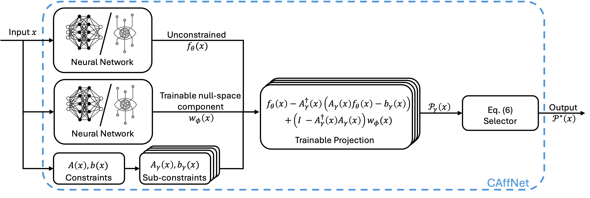

# CAffNet: Hard Constraint-Affine Neural Networks

## Authors

Yang Zhao<sup>1</sup>, Jungeun Lee<sup>2</sup>, Jeong hwan Jeon<sup>2</sup>, Sze Zheng Yong<sup>1</sup>

<sup>1</sup> Mechanical and Industrial Engineering, Northeastern University
<sup>2</sup> Electrical Engineering, Ulsan National Institute of Science and Technology

## Abstract

We present a novel framework for embedding hard constraint satisfaction into neural network (NN) architectures, specifically feedforward neural networks and transformers, with input-dependent affine constraints of arbitrary cardinality. Traditional constraint enforcement approaches either rely on penalty-based soft constraints, which offer no guarantee of satisfaction, or on post-processing methods that enforce constraints after the NN is trained, which may lead to suboptimality. We introduce a trainable constraint-affine (CAffine) layer into NNs, yielding CAffNet, which goes beyond enforcing affine constraints via fixed orthogonal or parallel projections and enables joint optimization with network parameters. Moreover, we impose no restrictions on the constraint space dimensions and establish that our construction preserves the universal approximation properties of NNs, while providing provable guarantees on constraint adherence for all inputs. Experimental validation demonstrates robust performance across diverse domains requiring guaranteed constraint satisfaction.

## Framework



## Paper

[Read the preprint](https://arxiv.org/abs/2605.24437)

## More Information

### CAffNet-Lite

CAffNet-Lite is a lightweight extension of CAffNet for safe-by-design neural network control.

- Introduces a lightweight constraint decomposition strategy that reduces computation while preserving hard constraint satisfaction and approximation performance.
- Jointly learns a neural network controller and neural-network-parameterized CBF parameters, avoiding an online QP safety filter at run time.
- [Read the preprint](https://arxiv.org/abs/2605.26534)

## Contact

- [Email](mailto:zhao.yang12@northeastern.edu?cc=jungeunlee@unist.ac.kr,jhjeon@unist.ac.kr,s.yong@northeastern.edu)
- [LinkedIn](https://www.linkedin.com/in/yang-zhao-b152991a2/)

## Repository Structure

```text
src/
|-- base/                 # Shared system, constraint, network, simulation, result, and main classes
|-- methods/              # NN, HardNet, CAffNet-FF, CAffNet-FF (Lite), and CAffNet-TF
|-- scenarios/
|   |-- pwc/              # Piecewise-constraint regression
|   |-- opt/              # Constrained optimization solver
|   `-- cbf/              # Control-barrier-function rollout
`-- utils/                # CAffine projection, configuration, result, and CBF utilities

run.sh                    # Local multi-method runner
run_cluster.slurm         # Slurm/Apptainer runner
env.def                   # Apptainer image definition
requirements.txt          # Python dependencies
results.zip               # Precomputed experiment outputs
```

## Installation

Run all commands from the repository root. Python 3.10 is recommended because it
matches the container definition.

```bash
git clone https://github.com/ice-t-lab/CAffNet-Hard-Constraint-Affine-Neural-Networks.git
cd CAffNet-Hard-Constraint-Affine-Neural-Networks

python3 -m venv .venv
source .venv/bin/activate
python3 -m pip install --upgrade pip
python3 -m pip install -r requirements.txt
```

The code automatically uses CUDA when it is available and otherwise runs on CPU.
The pinned dependencies include PyTorch 2.10.0 and `python-box`, which provides the
`Box` configuration objects used throughout the code.

To inspect the precomputed results without training, extract the included archive:

```bash
unzip -n results.zip
```

## Scenarios And Methods

Use the method names exactly as shown. Quote names that contain spaces or
parentheses.

| Scenario                 | Module name | Methods used in the experiments                                                                   |
| ------------------------ | ----------- | ------------------------------------------------------------------------------------------------- |
| Piecewise constraints    | `pwc`     | `NN`, `HardNet`, `CAffNet-FF`, `CAffNet-TF`                                               |
| Optimization solver      | `opt`     | `Optimizer (IPOPT)`, `NN`, `HardNet`, `CAffNet-FF`, `CAffNet-FF (Lite)`, `CAffNet-TF` |
| Control barrier function | `cbf`     | `NN`, `HardNet`, `CAffNet-FF`                                                               |

`Optimizer (IPOPT)` is the GEKKO/IPOPT reference solver and does not train a
network. `CAffNet-FF (Lite)` is used only in the optimization-solver comparison.

## Running One Experiment

Every scenario accepts the same three command-line arguments:

- `--dir_name`: experiment group under `results/<scenario>/`.
- `--seed`: random seed used for data, initialization, and training.
- `--method`: one method from the table above.

For example, train and evaluate CAffNet-FF on PWC with seed 1:

```bash
python3 -m src.scenarios.pwc.main \
  --dir_name final \
  --seed 1 \
  --method "CAffNet-FF"
```

Run the lightweight optimization model with:

```bash
python3 -m src.scenarios.opt.main \
  --dir_name final \
  --seed 1 \
  --method "CAffNet-FF (Lite)"
```

Run the IPOPT reference solver with:

```bash
python3 -m src.scenarios.opt.main \
  --dir_name final \
  --seed 1 \
  --method "Optimizer (IPOPT)"
```

The complete workflow is handled automatically: construct the scenario, train the
selected network, evaluate it once, save the model and plotting data, and update
the result files. Runs currently start from epoch 1, so use a new `dir_name` when
you do not want to overwrite an existing method result.

## Running Multiple Methods

Use the same `dir_name` and seed for methods that should be compared together.
For example, the CBF experiment uses:

```bash
methods=("NN" "HardNet" "CAffNet-FF")

for method in "${methods[@]}"; do
  python3 -m src.scenarios.cbf.main \
    --dir_name final \
    --seed 10 \
    --method "$method"
done
```

The included local runner has the interface:

```bash
./run.sh <scenario> <dir_name> <seed>
```

For example:

```bash
./run.sh pwc final 1
```

As currently configured, `run.sh` executes the four PWC methods: `NN`, `HardNet`,
`CAffNet-FF`, and `CAffNet-TF`. When using it for OPT or CBF, change only the
explicit method command lines in `run.sh` to the scenario-specific set listed
above.

## Configuration

Each scenario is controlled by its own YAML file:

- `src/scenarios/pwc/cfg.yaml`
- `src/scenarios/opt/cfg.yaml`
- `src/scenarios/cbf/cfg.yaml`

The main configuration sections are:

| Section                 | Purpose                                                                     |
| ----------------------- | --------------------------------------------------------------------------- |
| `system`              | Input/output dimensions, constraints, obstacles, and system parameters      |
| `net.ff`              | Feedforward hidden dimensions, activation, dropout, and batch normalization |
| `net.tf`              | Transformer model dimension, attention heads, activation, and dropout       |
| `simulation.data`     | Training, validation, and evaluation sample settings                        |
| `simulation.training` | Learning rate, epochs, batch size, and soft-constraint weight               |
| `simulation.logging`  | Epoch logging frequency                                                     |
| `simulation.save`     | Model, metric, loss, rollout, and figure output switches                    |
| `simulation.rollout`  | CBF time step, horizon, and initial state                                   |
| `visualization`       | Figure dimensions, axes, styles, and legend settings                        |

The resolved configuration is copied to each seed directory as `cfg.yaml`, which
records the settings associated with saved results.

## Saved Results

Results use the following hierarchy:

```text
results/<scenario>/<dir_name>/seed_<seed>/
|-- cfg.yaml
|-- log.txt
|-- evaluation.csv
|-- evaluation.tex
|-- result.png                    # When figure saving is enabled
|-- loss.png                      # For trained methods with saved loss history
|-- control.png                 # CBF only
`-- <method>/
    |-- model.pt                  # Trained network methods only
    |-- evaluation.csv
    |-- loss.csv                  # Trained network methods only
    |-- loss.pt                   # Trained network methods only
    `-- result.pt
```

`result.pt` contains the tensors needed for plotting. The result notebooks load
these saved tensors and CSV files directly; they do not reload and evaluate the
networks.

Training progress is written both to the terminal and to `log.txt` using the same
table-style logging as the rebuttal experiments.

## Tables And Figures

Install JupyterLab if it is not already available:

```bash
python3 -m pip install jupyterlab
jupyter lab
```

Then open the appropriate notebook:

- `src/scenarios/pwc/result.ipynb`
- `src/scenarios/opt/result.ipynb`
- `src/scenarios/cbf/result.ipynb`

Set `DIR_NAME` in the first code cell to the experiment group you want to process,
then run all cells. The notebooks generate the cross-seed CSV and LaTeX tables and
the rebuttal-style figures from saved data. The default reproduction settings are:

| Scenario | Table seeds                         | Plot seed             |
| -------- | ----------------------------------- | --------------------- |
| PWC      | `1, 3, 5, 6, 7`                   | `6`                 |
| OPT      | `1, 2, 5, 7, 12`                  | Not applicable        |
| CBF      | All complete seeds found in the run | `10`                  |

Generated aggregate files are written to `results/<scenario>/<dir_name>/`,
including `evaluation_all_seeds.csv`, `evaluation_all_seeds.tex`, and the selected
seed figures.

## Running On A Slurm Cluster

Build the Apptainer image from the repository root. Depending on the cluster,
administrator privileges or `--fakeroot` may be required.

```bash
apptainer build --fakeroot env.sif env.def
```

Create the log directory before submitting because Slurm opens output files before
the job script starts:

```bash
mkdir -p logs
```

Submit a seed array with the scenario and shared result directory name as
positional arguments:

```bash
sbatch --array=1,3,5,6,7 run_cluster.slurm pwc final
```

`run_cluster.slurm` maps each array task ID to the experiment seed, mounts the
repository at `/workspace`, and calls `run.sh` inside `env.sif`. Update the
`#SBATCH` partition, GPU type, memory, time limit, and array range for the target
cluster. Also make sure `run.sh` contains the correct method list for the selected
scenario.

## Extending The Code

The classes under `src/base/` contain the shared workflow. A new scenario normally
needs only a directory under `src/scenarios/` containing:

1. `system.py` for data generation, dynamics, and the scenario objective.
2. `constraint.py` for HardNet and CAffNet constraint coefficients.
3. `simulation.py` for scenario-specific loss or rollout behavior. Override
   `simulate()` when each training batch must run a multi-step system rollout.
4. `visualization.py` for problem-specific plots.
5. `main.py` to connect those objects through the `BaseMain` build methods.
6. `cfg.yaml` for all experiment and visualization settings.

Standard supervised scenarios can reuse most of `BaseSimulation` directly. The
CBF scenario is the reference for rollout-based training. Shared network builders
are in `src/base/net.py`, method wrappers are in `src/methods/`, and CAffine
projection operations are in `src/utils/CAffine.py`.